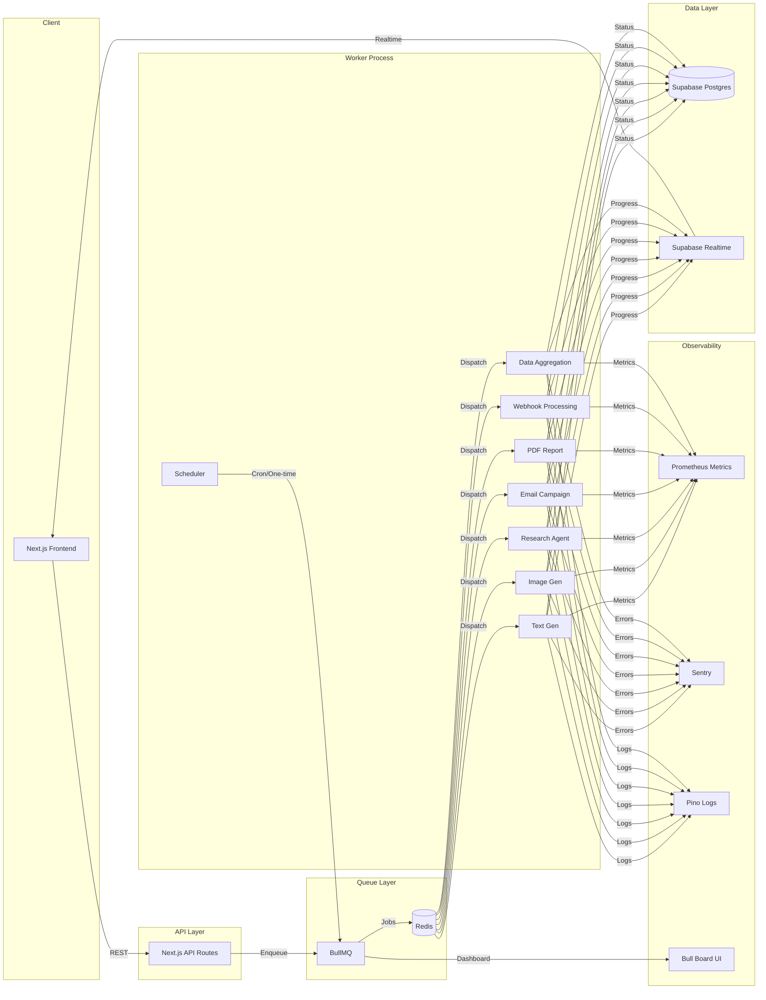
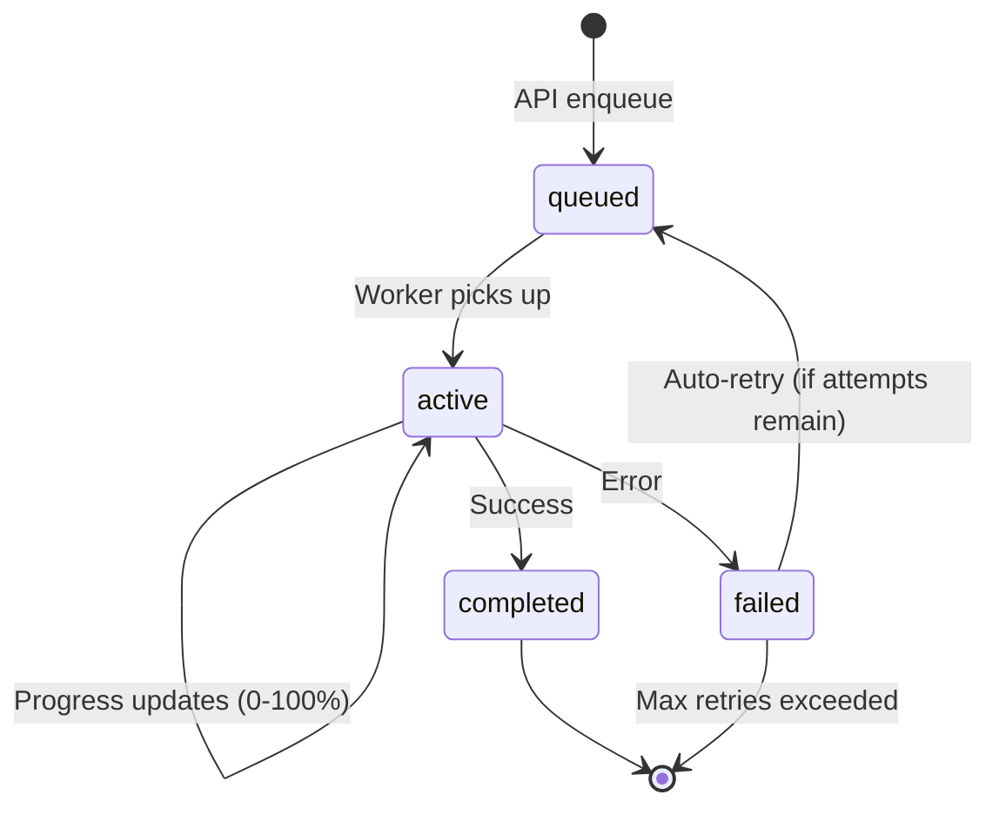
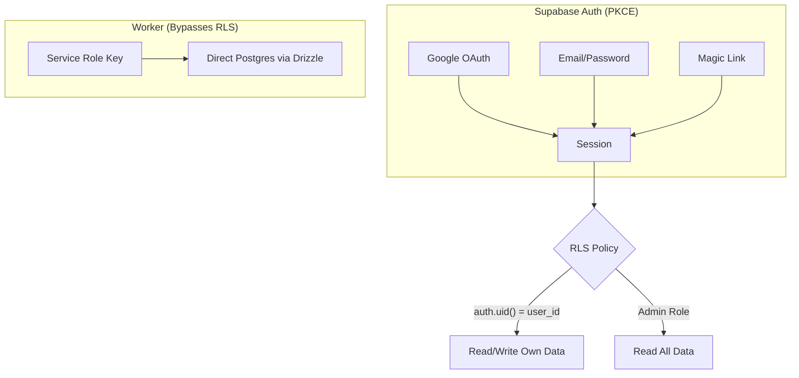
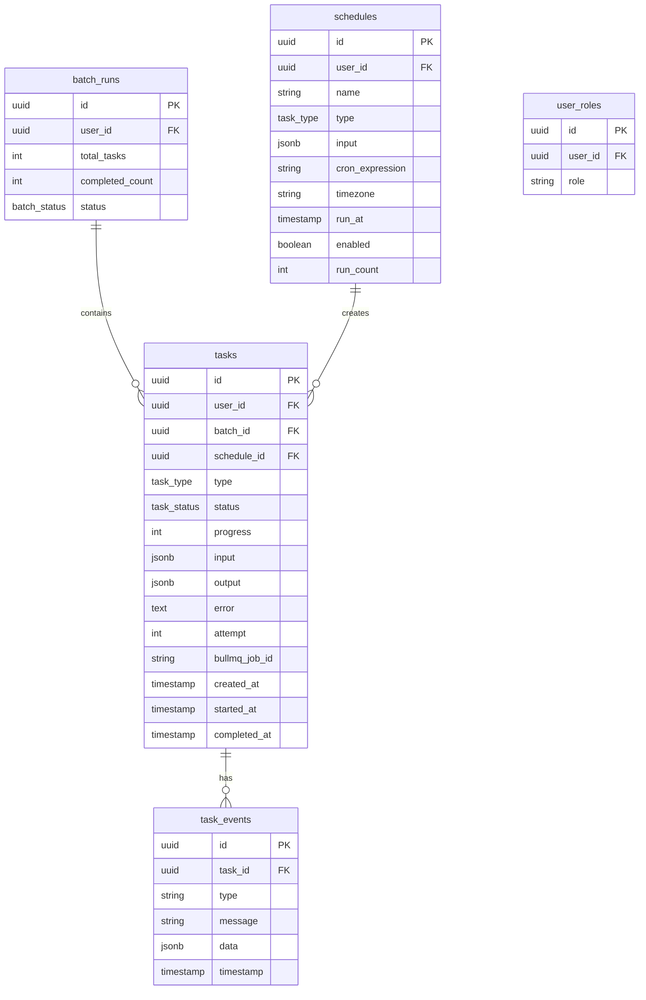

<p align="center">
  <strong>Task Queue</strong>
  <br />
  Distributed async task orchestration with real-time monitoring
</p>

<p align="center">
  
  
  
  
  
  
</p>

---

## Overview

A production-grade distributed task queue system built as a Bun monorepo. Supports 7 task types with per-queue concurrency limits, rate limiting, retries, scheduled/one-time execution, batch processing, and real-time progress streaming.



## Tech Stack

| Layer | Technology | Purpose |
|-------|-----------|---------|
| **Runtime** | Bun | Package manager, monorepo workspaces, test runner |
| **Frontend** | Next.js 16, React 19, Tailwind v4 | App Router, RSC, streaming |
| **UI** | shadcn/ui, Phosphor Icons, Motion | Component library, icons, animations |
| **State** | TanStack Query v5 | Server state, optimistic updates, infinite scroll |
| **Auth** | Supabase Auth (PKCE) | Google OAuth, email/password, RLS |
| **Database** | Supabase Postgres, Drizzle ORM | Row-level security, generated types |
| **Queue** | BullMQ, Redis 7 | Job scheduling, rate limiting, retries |
| **Realtime** | Supabase Realtime | Postgres changes, broadcast channels |
| **Observability** | Sentry, Prometheus, Pino, PostHog | Errors, metrics, logs, analytics |
| **Testing** | Vitest, Playwright, Testing Library | Unit, E2E, component tests |
| **Deployment** | Vercel (web), Docker (Redis) | Edge functions, container orchestration |

## Project Structure

```
task-queue/
├── apps/
│   ├── web/                    # Next.js 16 frontend + API routes
│   │   ├── app/
│   │   │   ├── (auth)/        # Login flow (multi-step, OAuth, password reset)
│   │   │   ├── dashboard/     # Protected pages (tasks, batches, schedules, queue health)
│   │   │   └── api/           # REST endpoints (tasks, batches, schedules, admin stats)
│   │   ├── components/        # UI components (task grid, batch progress, schedule list)
│   │   ├── hooks/             # React hooks (use-tasks, use-schedules, use-batches)
│   │   ├── lib/               # Auth, Supabase clients, queue helpers, utilities
│   │   └── e2e/               # Playwright test suites
│   │
│   ├── worker/                # BullMQ worker process
│   │   └── src/
│   │       ├── workers/       # 7 task workers + scheduler
│   │       └── lib/           # DB, logger, metrics, health, alerting
│   │
│   └── trigger/               # Trigger.dev integration (alternative orchestration)
│       └── tasks/             # 9 Trigger.dev task definitions
│
├── packages/
│   └── shared/                # Shared types, queue config, Drizzle schema
│       └── src/
│           ├── types.ts       # TaskType, TaskStatus, job payloads, broadcast events
│           ├── queue-config.ts # Per-queue concurrency, rate limits, Redis connection
│           └── schema.ts      # Drizzle schema (tasks, schedules, batch_runs, task_events)
│
├── supabase/
│   └── migrations/            # 4 SQL migrations (tables, RLS, realtime, one-time schedules)
│
├── docker-compose.yml         # Redis 7 Alpine with AOF persistence
└── package.json               # Bun workspace root
```

## Task Types & Queue Configuration

| Task Type | Concurrency | Rate Limit | Retries | Use Case |
|-----------|------------|------------|---------|----------|
| `text_gen` | 10 | 20/min | 3 | Text generation via LLM |
| `image_gen` | 5 | 10/min | 3 | AI image generation |
| `research_agent` | 3 | 5/min | 2 | Research & summarization |
| `email_campaign` | 5 | 50/min | 5 | Email delivery |
| `pdf_report` | 3 | 10/min | 3 | PDF document generation |
| `webhook_processing` | 10 | 100/min | 5 | Webhook payload processing |
| `data_aggregation` | 1 | 5/min | 3 | Data pipeline aggregation |

## Architecture

### Task Lifecycle



### Authentication & Authorization



### Three Supabase Clients

| Client | Key | Use Case |
|--------|-----|----------|
| **Browser** | Publishable (anon) | Client-side auth, realtime subscriptions |
| **Server** | Publishable + cookies | SSR auth checks, API route guards |
| **Admin** | Service role (secret) | Worker DB access, bypasses RLS |

### Worker Architecture

The worker process runs as a single Bun process managing:

- **7 BullMQ Workers** — one per task type with independent concurrency/rate limits
- **Scheduler Worker** — syncs cron and one-time schedules from DB
- **Health Server** (`:9090`) — Redis ping health check
- **Metrics Server** (`:9092`) — Prometheus scrape endpoint
- **Bull Board** (`:9091`) — Visual queue management UI

### Observability Stack

| Tool | Purpose | Integration |
|------|---------|-------------|
| **Sentry** | Error tracking + performance | Server/client/edge, `/monitoring` tunnel |
| **Prometheus** | Queue metrics (depth, duration, throughput) | Worker prom-client, custom histograms |
| **Pino** | Structured logging | Worker process, JSON in prod |
| **PostHog** | Product analytics | Client-side events |
| **Vercel Analytics** | Web vitals + speed insights | Automatic |
| **Microsoft Clarity** | Session replay + heatmaps | Client-side |

## Database Schema



## Getting Started

### Prerequisites

- [Bun](https://bun.sh) v1.2+
- [Docker](https://docker.com) (for Redis)
- [Supabase CLI](https://supabase.com/docs/guides/cli) (for local Postgres)

### Setup

```bash
# Clone and install
git clone <repo-url> task-queue
cd task-queue
bun install

# Start infrastructure (Redis + Supabase)
docker compose up -d
supabase start

# Generate environment variables
bun run setup

# Run database migrations
bun run db:push

# Start development (all apps)
bun run dev
```

### Development Commands

| Command | Description |
|---------|-------------|
| `bun run dev` | Start all apps (web + worker) |
| `bun run dev:web` | Start Next.js frontend only |
| `bun run dev:worker` | Start BullMQ worker only |
| `bun run db:new <name>` | Create new Supabase migration |
| `bun run db:push` | Apply migrations to local DB |
| `bun run db:reset` | Reset local database |

### Ports

| Service | Port | Description |
|---------|------|-------------|
| Next.js | 3000 | Web frontend + API |
| Worker Health | 9090 | Health check endpoint |
| Bull Board | 9091 | Queue management UI |
| Metrics | 9092 | Prometheus scrape target |
| Redis | 6379 | Job queue backend |
| Supabase | 54321+ | Local Supabase stack |

## Security

- **Row-Level Security (RLS)** on all tables — users can only access their own data
- **Security headers**: HSTS, X-Frame-Options DENY, X-Content-Type-Options nosniff, CSP, Permissions-Policy
- **PKCE auth flow** — no client secrets exposed
- **Service role isolation** — only the worker process has elevated DB access
- **Input validation** — Zod schemas on all API route inputs
- **Sentry tunnel** — `/monitoring` route proxies Sentry to avoid ad blockers

## License

Private
